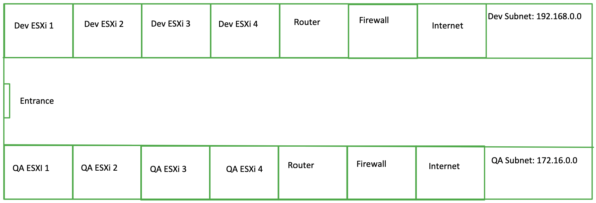
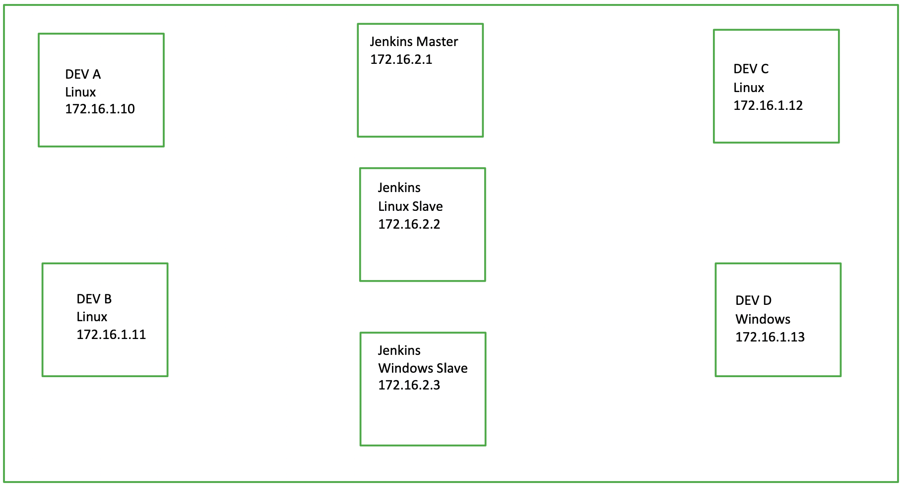

# Dev and QA Lab

The purpose of the Dev and QA Lab is to house equipment needed by the development and qa teams

## Getting Access

Access to the lab will be provided by your manager.  Your door badge will be given access to the lab.
You will be notified when this is done.

## Layout

A basic layout of the lab can be seen below:

The development and QA servers are on different subnets and access to each will be configured in the vpn profile assigned to you.
A VPN profile will be created for you by your manager and emailed to you to install on your computer.

A basic layout of the QA test server environment can be seen below:

The firewall in the QA subnet will have a rule, allowing access to an Artifactory server in the development subnet.  This will give Jenkins
access to pull latest builds by development to install on QA test servers.

## Future

A server will be added to the QA test enviroment for centralized logging of test runs.